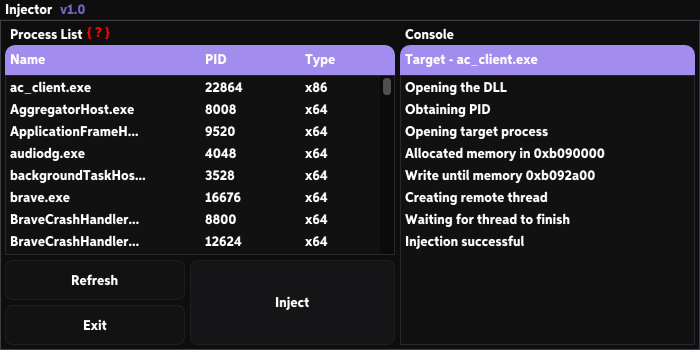

### Injects for you a dynamic link library(Dll) into a process

> [!NOTE]
> - This injector has been tested on the Windows operating system.
> - This injector has only been tested on x86 processes.
> - To build this project, you need to have CMake installed. You can install it <a href="https://cmake.org/download/">here</a>

# GUI Preview


# How does this work?
### 1. Identify the target process
Determine the process where the DLL will be injected

### 2. Open the target process
Access the target process, enabling memory manipulation

### 3. Allocate memory in the target process
Reserve memory within the target process for loading the DLL

### 4. Write the DLL file path into the allocated memory
Copy the DLL file path into the reserved memory space of the target process

### 5. Create a remote thread
Generate a thread within the target process to load the DLL

# How to use this injector?
### 1. Select a process
Find the target process in the 'Process List' and select it

### 2. Select your DLL
Click on the 'Inject' button and choose your DLL

# Getting Started
### 1. Clone this project using Git
```bash
git clone https://github.com/Z1KOx/Injector.git
```
- If you don't have Git installed, you can download it <a href="https://git-scm.com/downloads">here</a>

### 2. Run build.bat
This will compile and link the executable, and it will provide you with the path where the .exe file is located.
